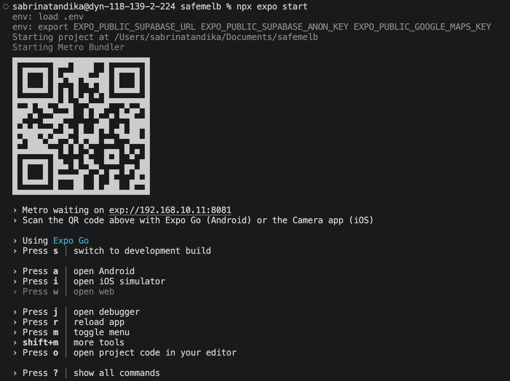
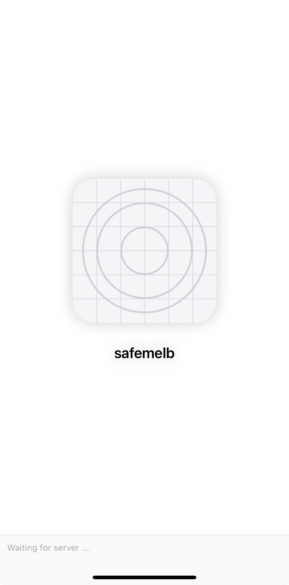

# Phase 1 — Setup & Foundations

**Completed:** Week 1  
**Status:** ✅ Complete

---

## Overview

Phase 1 covers the full project setup — from development environment to the scaffolded app running on a real device. By the end of this phase, the project had a working navigation structure, a live Supabase backend, and Google Maps configured and ready for Phase 2.

---

## What was built

- Initialised React Native + Expo project with TypeScript
- Set up ESLint + Prettier for consistent code formatting
- Created GitHub repo with branching strategy (main / dev / feature branches)
- Configured Supabase project with database schema, Row Level Security, and a storage bucket for incident photos
- Enabled Google Maps SDK and added API key configuration
- Built bottom tab navigation using Expo Router (Map, Report, Tips, Profile)
- Established folder structure and design system constants (colours, typography)

---

## Technical decisions

### Supabase over Firebase

Supabase was chosen over Firebase for three reasons: it's built on PostgreSQL (more portable and familiar), the free tier is significantly more generous, and Row Level Security gives fine-grained access control without a separate rules language.

### Expo Router over React Navigation

Expo Router uses file-based routing — the same mental model as Next.js. This makes the project structure more intuitive and reduces boilerplate compared to manually defining a navigation stack in React Navigation.

### TypeScript from day one

Starting with TypeScript avoids the painful migration later. It also makes the codebase look more professional in a portfolio context, and catches common bugs (null checks, wrong prop types) at compile time rather than runtime.

---

## Challenges

### 1. npm ERESOLVE peer dependency errors

**Problem:** Installing ESLint, Supabase, and other packages kept failing with `ERESOLVE could not resolve` errors. This was caused by React 19 being installed while many packages still listed older React versions as their peer dependency.

**Fix:** Set `legacy-peer-deps` as the project default:

```bash
npm config set legacy-peer-deps true
```

---

### 2. Expo SDK version mismatch with Expo Go on iPhone

**Problem:** The project was scaffolded with SDK 56 but Expo Go on the iPhone only supported SDK 54, causing a version mismatch error on every launch.

**Fix:** Upgraded the project to SDK 54 to match the phone:

```bash
npx expo install expo@~54.0.0 --fix -- --legacy-peer-deps
```

---

### 3. Expo scaffold blocked by existing files

**Problem:** Running `npx create-expo-app@latest .` failed because existing project files would be overwritten and the CLI refused to proceed.

**Fix:** Temporarily moved existing files to a backup folder, ran the scaffold, then restored them:

```bash
mkdir ../temp_backup
mv README.md docs .env.example .prettierrc .claude .expo ../temp_backup/
npx create-expo-app@latest . --template blank-typescript
mv ../temp_backup/* .
```

---

## Commits this phase

| Commit  | Message                                                     |
| ------- | ----------------------------------------------------------- |
| Initial | `docs: initial README`                                      |
| Setup   | `feat: initialise Expo project with TypeScript`             |
| Backend | `feat: add Supabase client setup`                           |
| Maps    | `feat: add Google Maps configuration`                       |
| Nav     | `feat: complete Phase 1 setup — navigation, Supabase, Maps` |

---

## Screenshots

| Terminal — `npx expo start`                        | App running on iPhone                              |
| -------------------------------------------------- | -------------------------------------------------- |
|  |  |

---

## What's next

**Phase 2** — Building the core screens: the home/map screen with live incident markers pulled from Supabase, and the report incident form with location auto-fill and photo upload.
