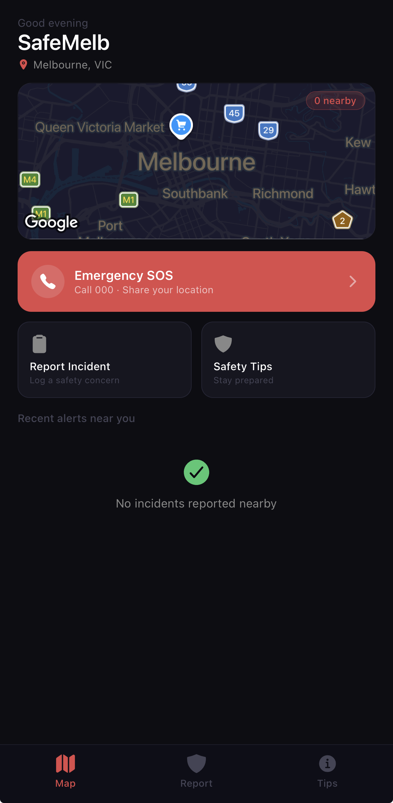
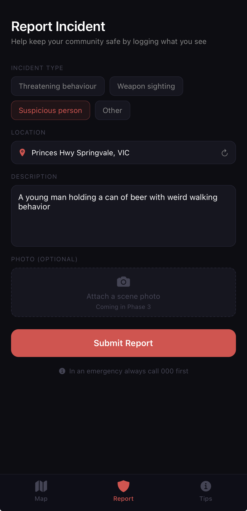
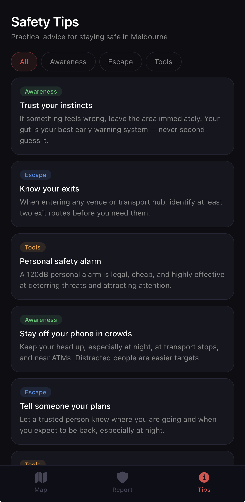

# Phase 2 — Core Features

**Completed:** Week 2  
**Status:** ✅ Complete

---

## Overview

Phase 2 delivered all three core screens of the app — the home/map screen with live incident data, the incident report form with automatic location detection, and the safety tips screen with category filtering. All screens connect to the live Supabase backend set up in Phase 1.

---

## What was built

- **Home/Map screen** — Google Maps integration with dark map style, live incident pins colour-coded by severity, emergency SOS button with confirmation alert, quick action cards, and a recent alerts feed pulled from Supabase
- **Report Incident screen** — incident type selector, automatic location detection via `expo-location` with reverse geocoding to show a readable address, description text area, and form submission directly to Supabase
- **Safety Tips screen** — scrollable tip cards with category filter tabs (All, Awareness, Escape, Tools), colour-coded category badges
- **Empty state** on the map screen when no incidents are nearby
- **Design system** — `constants/Colors.ts` and `constants/Tips.ts` used across all screens for consistency

---

## Technical decisions

### Static JSON for tips data

Safety tips are stored in `constants/Tips.ts` as a static array rather than fetching from Supabase. This means the tips screen loads instantly with no network call, which is better UX for content that rarely changes.

### reverseGeocodeAsync for address display

Instead of showing raw coordinates on the report form, `Location.reverseGeocodeAsync()` converts the user's GPS coordinates into a readable street address automatically. This makes the form feel polished and reduces friction.

### Colour-coded map pins

Incident pins are red for serious incidents (Weapon sighting, Threatening behaviour) and amber for lower-severity reports (Suspicious person, Other). This gives users an immediate visual severity signal without reading the label.

### Dark map style

A custom `darkMapStyle` array was applied to MapView to match the app's dark colour palette. Without this the map would show Google's default white/grey style which clashes with the dark UI.

---

## Challenges & fixes

### 1. App showed "Open up App.tsx" instead of the screens

**Problem:** After scaffolding and adding the screen files, the app still showed the default Expo placeholder screen. This was because `package.json` still had `"main": "index.ts"` pointing to the old entry point instead of Expo Router.

**Fix:** Updated `package.json` to use Expo Router's entry point:

```json
"main": "expo-router/entry"
```

Also cleared `App.tsx` and updated `index.ts`:

```typescript
import 'expo-router/entry';
```

Then restarted with cache cleared:

```bash
npx expo start --clear
```

---

### 2. Safety Tips filter tabs stretched to full screen height

**Problem:** The horizontal `ScrollView` for the category filter tabs was giving each tab button the full screen height instead of a small pill shape, making the UI look broken.

**Fix 1:** Added `alignSelf: 'flex-start'` and a fixed `height: 32` to the tab style so each button sizes to its content.

**Fix 2:** Wrapped the horizontal ScrollView in a `View` with a fixed `height: 52` to constrain the tab row:

```typescript
tabsWrapper: { height: 52 },
tab: { height: 32, alignSelf: 'flex-start', justifyContent: 'center' },
```

---

### 3. Large gap between filter tabs and tip cards

**Problem:** After fixing the tab height, a large empty gap appeared between the tab row and the tips list below it.

**Fix:** The `ScrollView` container style had excessive padding. Replaced `paddingVertical` with `alignItems: 'center'` and tightened the wrapper height so the layout collapses correctly with no leftover space.

---

### 4. npm install failures continuing from Phase 1

**Problem:** Installing `react-native-maps` and `expo-location` continued to throw `ERESOLVE` peer dependency errors even after setting `legacy-peer-deps` globally.

**Fix:** The global config wasn't being picked up by `npx expo install`. Used npm directly with the flag explicitly:

```bash
npm install react-native-maps --legacy-peer-deps
npx expo install expo-location
npm install --legacy-peer-deps
```

---

## Screenshots

| Filename                                                                                        | What to capture |
| ----------------------------------------------------------------------------------------------- | --------------- |
|  |

||
||

---

## Commits this phase

| Commit  | Message                                                          |
| ------- | ---------------------------------------------------------------- |
| Screens | `feat: build Phase 2 — map screen, report form, and safety tips` |
| UI fix  | `fix: correct safety tips filter tab height and layout gap`      |
| Docs    | `docs: add Phase 2 documentation`                                |

---

## What's next

**Phase 3** — Supabase Auth (anonymous + email sign-in), realtime incident feed so the map updates live without refreshing, and Expo push notifications to alert nearby users when a new incident is reported in their area.
